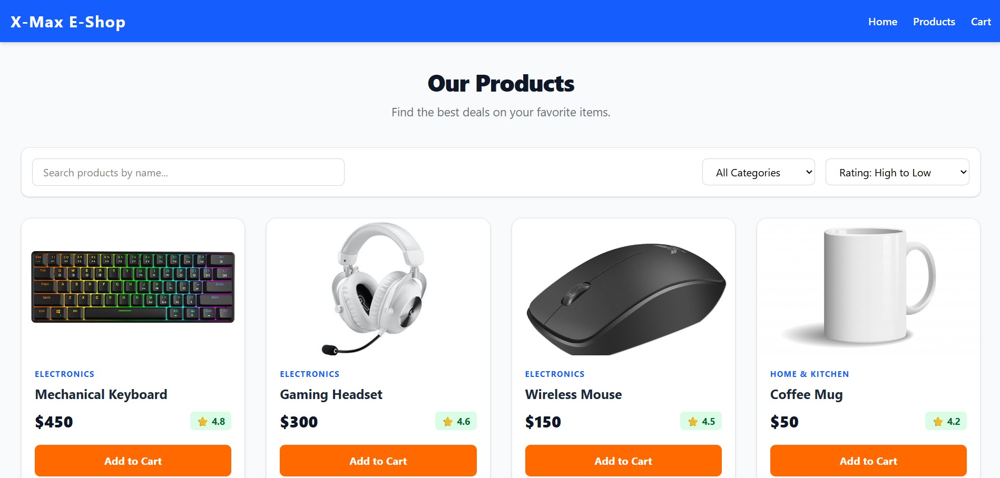

# 🛒 React Product Listing App

A responsive, single-page React application that displays a list of e-commerce products. Users can view products, search for specific items by name, filter them by category, and sort them by price or rating. 

This project was built as an assignment for the **Entri Elevate - Full Stack Development** program.

## 📸 Demo Preview

*(Below is a preview of the Product Listing App)*




> **Note:** The UI is fully responsive and adjusts seamlessly across mobile, tablet, and desktop views.

## ✨ Features

- **Product Grid Display:** Clean and responsive grid layout showcasing product image, name, category, price, and rating.
- **Search Functionality:** Real-time search bar to filter products based on their name.
- **Category Filter:** Dropdown menu to filter products by specific categories (Electronics, Fashion, Home & Kitchen, etc.).
- **Sorting Options:** Ability to sort products dynamically:
  - Price: Low to High
  - Price: High to Low
  - Rating: High to Low
- **Add to Cart Simulation:** Interactive "Add to Cart" button that logs the selected product's name to the browser console.
- **Responsive Design:** Fully optimized for mobile, tablet, and desktop screens using Tailwind CSS v4.

## 🛠️ Tech Stack

- **Frontend Framework:** [React.js](https://react.dev/) (Bootstrapped with Vite)
- **Styling:** [Tailwind CSS v4](https://tailwindcss.com/)
- **State Management:** React Hooks (`useState`)

## 📂 Project Structure

```text
product-list/
├── src/
│   ├── components/
│   │   ├── data.jsx          # Mock product data
│   │   ├── Navbar.jsx        # Navigation bar component
│   │   ├── FilterBar.jsx     # Search, filter, and sort controls
│   │   ├── ProductCard.jsx   # Individual product display component
│   │   └── ProductList.jsx   # Grid layout mapping the product cards
│   ├── App.jsx               # Main application logic and state
│   ├── index.css             # Tailwind CSS directives
│   └── main.jsx              # Application entry point
├── index.html
├── package.json
└── vite.config.js